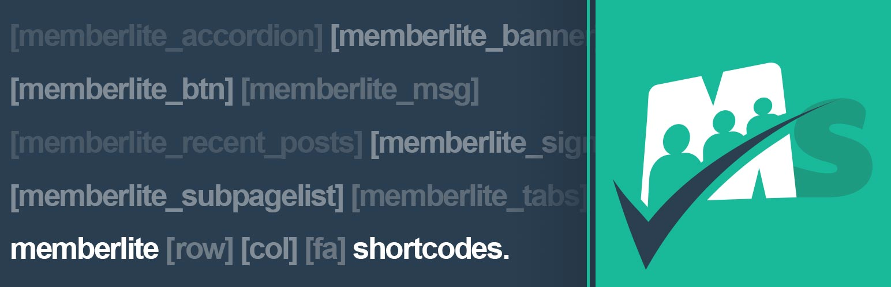

# [Memberlite Shortcodes](https://memberlitetheme.com/memberlite-shortcodes/) #

  

### Welcome to the Memberlite Shortcodes GitHub Repository
For sites running the [Memberlite Theme](https://memberlitetheme.com/) or a Memberlite Child Theme, this plugin offers several shortcodes to simplify the use of various display elements and enhance the appearance of your site content.

[Memberlite](https://memberlitetheme.com) is the ideal theme for your membership site - packed with integration for top membership site plugins including [Paid Memberships Pro](https://wordpress.org/plugins/paid-memberships-pro/). It's fully customizable with your logo, colors, fonts, custom sidebars, and more global layout settings.

For more information please visit [the shortcodes documentation page at the Memberlite Theme website](https://memberlitetheme.com/memberlite-shortcodes/).

## Installation ##
For detailed installation steps, visit the our [documentation](https://memberlitetheme.com/memberlite-shortcodes/) page.

1. Download the current development ZIP file directly: `https://github.com/strangerstudios/memberlite-shortcodes/archive/dev.zip`

**Please ensure that once installing this version of the plugin to remove `-dev` from the plugin's folder name.**

## Bugs ##
If you find an issue/bug, let us know by [creating a detailed GitHub issue](https://github.com/strangerstudios/memberlite-shortcodes/issues/new).

## Support ##
This is a developer's portal for Memberlite Shortcodes. We do not offer support on this channel. **Any support related questions should be directed to [the Memberlite Theme website](https://memberlitetheme.com/).**

## Contributing to Memberlite Shortcodes ##
We encourage and welcome any contribution to Memberlite Shortcodes. Please read the [guidelines for contributing](https://github.com/strangerstudios/memberlite-shortcodes/blob/dev/.github/CONTRIBUTING.md) to this repository.

There are various **ways to help development** of Memberlite Shortcodes:

1. Report [bugs/issues](https://github.com/strangerstudios/memberlite-shortcodes/issues/new) on GitHub.
2. Work on any issues by submitting a Pull Request.

Here are some ways for **non-developers to contribute** to Memberlite Shortcodes:

1. Translate Memberlite Shortcodes into your own [language](https://translate.wordpress.org/projects/wp-plugins/memberlite-shortcodes/).
2. [Purchase a Memberlite Support membership](https://memberlitetheme.com/pricing/) to help fund ongoing development and bug fixes.
3. Leave an honest review for [Memberlite Shortcodes](https://wordpress.org/support/plugin/memberlite-shortcodes/reviews/#new-post).
